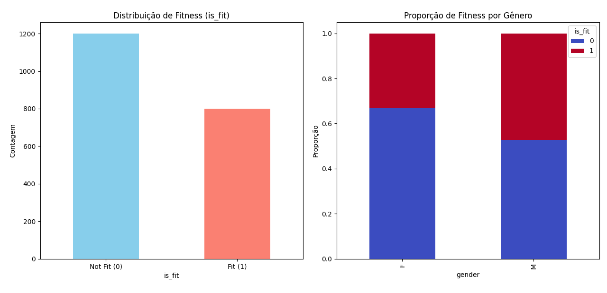
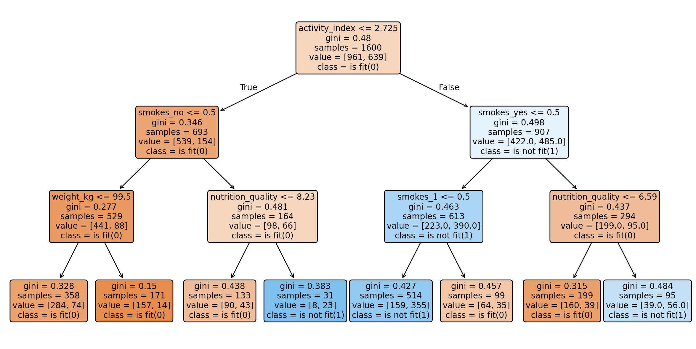
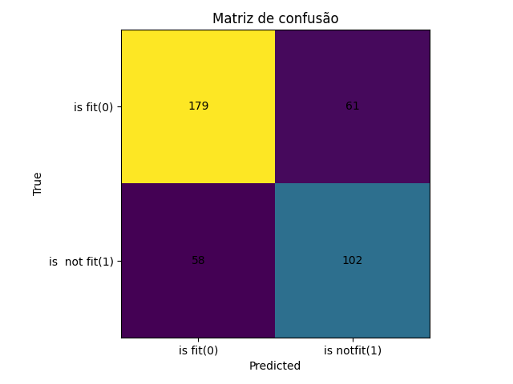

# Relatório do Projeto de Machine Learning

## 1. Exploração dos Dados 

Nesta etapa, foi realizada uma análise inicial do conjunto de dados, incluindo visualizações e estatísticas descritivas.  
O dataset contém informações sobre hábitos de vida, saúde e condicionamento físico dos participantes, como gênero, idade, peso, altura, tabagismo, qualidade da nutrição, horas de sono e índice de atividade física.  
A variável alvo, "is_fit", indica se a pessoa está em boa condição física ou não.  
A análise revelou que há mais pessoas classificadas como "Not Fit" (0) do que "Fit" (1), evidenciando um leve desbalanceamento.  
Além disso, observou-se que mulheres tendem a estar mais no grupo "Not Fit" em comparação aos homens, que apresentam uma distribuição mais equilibrada.



Essas informações são importantes para entender o perfil dos dados e possíveis desafios para os modelos, como o desbalanceamento das classes.

---

## 2. Pré-processamento 

Foi realizada a limpeza dos dados, substituindo valores ausentes pela moda de cada coluna, garantindo que não haja perda de informações importantes.  
Em seguida, foi aplicada a codificação One Hot Encoding para transformar variáveis categóricas em variáveis numéricas, tornando o conjunto de dados compatível com algoritmos de machine learning.  
Esse processo também incluiu a normalização dos dados, quando necessário, para garantir que todas as variáveis estejam na mesma escala e evitar que atributos com valores maiores dominem o treinamento dos modelos.

---

## 3. Divisão dos Dados 

Para avaliar o desempenho dos modelos de forma justa, o conjunto de dados foi dividido em treino e teste, utilizando 80% dos dados para treinamento e 20% para teste.  
Essa separação garante que o modelo seja avaliado em dados que não foram vistos durante o treinamento, evitando o problema de overfitting e permitindo uma estimativa mais realista da performance do modelo em novos dados.

**Exemplo de código:**
```python
from sklearn.model_selection import train_test_split

x_train, x_test, y_train, y_test = train_test_split(
    x, y, test_size=0.2, random_state=42, stratify=y
)
```

---

## 4. Treinamento dos Modelos 

O algoritmo de aprendizado de máquina implementado foi:

- **Decision Tree:** Um modelo interpretável que constrói uma árvore de decisões baseada nos atributos mais relevantes. Ele permite visualizar quais fatores são mais importantes para determinar se uma pessoa está "fit" ou "not fit".

**Exemplo de código:**
```python
import pandas as pd
import matplotlib.pyplot as plt
import os
from sklearn.tree import DecisionTreeClassifier, plot_tree

DATA_DIR = "data"
IMG_DIR  = "data/img"
os.makedirs(IMG_DIR, exist_ok=True)

x_train = pd.read_csv(f"{DATA_DIR}/dataset-x-train.csv")
y_train = pd.read_csv(f"{DATA_DIR}/dataset-y-train.csv")["is_fit"]

# Certifique-se de que todas as colunas são numéricas
categorical_cols = x_train.select_dtypes(include=['object', 'category']).columns
if len(categorical_cols) > 0:
    x_train = pd.get_dummies(x_train, columns=categorical_cols, drop_first=True)

clf_viz = DecisionTreeClassifier(
    criterion="gini",
    max_depth=3,  # ajuste para 3
    random_state=42
)
clf_viz.fit(x_train, y_train)
```

A árvore de decisão revelou que o índice de atividade física, tabagismo, peso e qualidade da nutrição são os fatores mais importantes para determinar o condicionamento físico dos participantes.



---

## 5. Avaliação dos Modelos 

O modelo foi avaliado utilizando métricas apropriadas, como acurácia, precisão, recall, F1-score e matriz de confusão.  
A acurácia indica a proporção de previsões corretas, enquanto precisão, recall e F1-score fornecem uma visão mais detalhada do desempenho em cada classe.  
A matriz de confusão mostra os acertos e erros do modelo Decision Tree, permitindo identificar onde o modelo está tendo dificuldades, como confundir pessoas "fit" com "not fit".

**Exemplo de código:**
```python
from sklearn.metrics import accuracy_score, precision_recall_fscore_support, confusion_matrix

y_pred = clf_viz.predict(x_test)
acc = accuracy_score(y_test, y_pred)
prec, rec, f1, _ = precision_recall_fscore_support(y_test, y_pred, average="macro")
cm = confusion_matrix(y_test, y_pred)
```



A Decision Tree teve bom desempenho, mas ainda comete erros, especialmente devido ao desbalanceamento das classes.  
A matriz de confusão e as métricas ajudam a identificar oportunidades de melhoria, como ajuste de hiperparâmetros ou técnicas de balanceamento.

---

## 6. Relatório Final

Todo o processo foi documentado, incluindo as etapas de exploração, pré-processamento, divisão dos dados, treinamento e avaliação do modelo.  
Os resultados obtidos indicam que o modelo consegue distinguir quem está "fit" e "not fit", mas ainda há espaço para melhorias, como ajuste de hiperparâmetros, técnicas de balanceamento das classes e inclusão de novas variáveis relevantes.  
A análise reforça que hábitos de vida, como atividade física, tabagismo, peso e nutrição, são determinantes para o condicionamento físico.